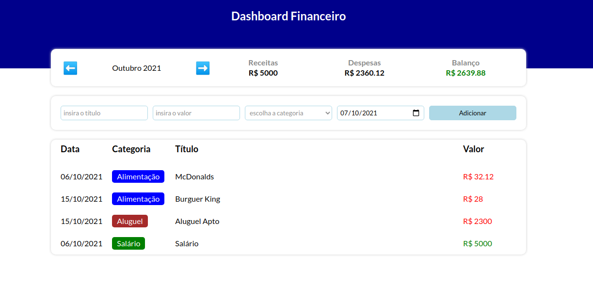

<h1 align="center">Dashboard Financeiro</h1>

<h1>
  </img>
</h1>

## 🔖 Sobre

Dashboard para monitoramento financeiro. O usuário pode cadastrar suas despesas, receitas e monitorar o balanço mensal. O projeto foi desenvolvido sem backend, com o propósito de exercitar o uso das tecnologias e lógica com validação de todos os campos do formulário e tratamento dados do tipo Date e valores monetários.

## 🛠 Tecnologias utilizadas

O projeto foi desenvolvido usando as seguintes tecnologias:

- [ReactJS](https://reactjs.org)
- [Typescript](https://www.typescriptlang.org/)
- [Styled Components](https://styled-components.com/)

## 📦 Como baixar o projeto

```bash

  # Clonar repositório
  $ git clone https://github.com/samuelfcf/dashboard0-financeiro

  # Entrar no diretório
  $ cd dashboard0-financeiro

  # Instalar dependências
  $ yarn install

  # Iniciar o projeto
  $ yarn start
```

---

Desenvolvido por Samuel Felipe Castro Fernandes
